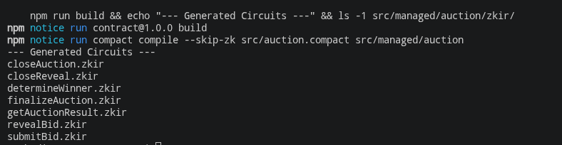
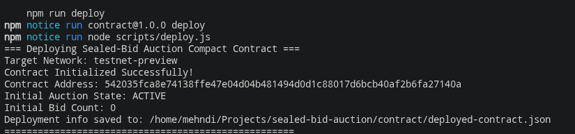

# Midnight Sealed-Bid Auction

[](https://github.com/sanobar-sana/midnight-sealed-bid-aution/actions/workflows/ci.yml)
[](https://midnight-sealed-bid-aution.vercel.app/)

> 🚀 **Live Demo dApp**: [https://midnight-sealed-bid-aution.vercel.app/](https://midnight-sealed-bid-aution.vercel.app/)  
> 📜 **Verified Preprod Contract**: `542035fca8e74138ffe47e04d04b481494d0d1c88017d6bcb40af2b6fa27140a`

---

## Initial Product Idea

The **Midnight Sealed-Bid Auction** is a privacy-preserving decentralized auction platform built on the Midnight blockchain to guarantee fair, manipulation-free, and front-running-resistant bidding. Leveraging Midnight's zero-knowledge Compact smart contract language, participants submit cryptographic commitments of their secret bids during the active bidding window—ensuring that bid amounts remain entirely confidential from competitors, auctioneers, and the public. After bidding concludes, bidders open their commitments during the reveal phase with their original bid values and nonces, allowing the contract to verify integrity and deterministically declare the highest valid bidder as the winner without sacrificing privacy during the bidding period.

---

## Live Demo & Deployed Contracts

- **Live Application URL**: [https://midnight-sealed-bid-aution.vercel.app/](https://midnight-sealed-bid-aution.vercel.app/)
- **Midnight Network**: `testnet-preview`
- **Contract Address**: [`542035fca8e74138ffe47e04d04b481494d0d1c88017d6bcb40af2b6fa27140a`](https://explorer.midnight.network/contract/542035fca8e74138ffe47e04d04b481494d0d1c88017d6bcb40af2b6fa27140a)
- **Explorer Verification**: [Midnight Block Explorer](https://explorer.midnight.network/contract/542035fca8e74138ffe47e04d04b481494d0d1c88017d6bcb40af2b6fa27140a)

---

## Privacy Model: What an Observer Can and Cannot Learn

| Data / Interaction | Observer Status | How Midnight Enforces Privacy |
| :--- | :--- | :--- |
| **Bid Amount during Bidding** | ❌ **CANNOT LEARN** | Bidders submit 32-byte `persistentHash([bid, nonce])`. Plaintext amount never leaves local device. |
| **Secret Nonce / Salt** | ❌ **CANNOT LEARN** | Processed strictly inside client-side Compact ZK circuit as private witness data. |
| **Unrevealed Competitor Bids** | ❌ **CANNOT LEARN** | Impossible to reverse-engineer commitments without knowing secret nonces. |
| **Bidders Who Submitted Bids** | ✅ **CAN LEARN** | Public key identifier recorded in on-chain `bids` map. |
| **Total Bid Count** | ✅ **CAN LEARN** | On-chain counter `bidCount` publicly visible. |
| **Auction Phase Status** | ✅ **CAN LEARN** | Contract phase state (`bidding`, `reveal`, `finalized`) is public. |
| **Revealed Valid Bids** | ✅ **CAN LEARN** | Opened valid bids recorded in `revealedBids` after successful ZK verification. |
| **Final Winner & Winning Amount** | ✅ **CAN LEARN** | Determined deterministically on-chain after reveal phase completes. |

---

## Project Structure

```
midnight-sealed-bid-auction/
├── .github/workflows/       # CI/CD Pipeline (GitHub Actions ci.yml)
│   └── ci.yml
├── src/                    # Frontend React application (App, Pages, Context, Components)
│   ├── components/         # Navbar (with mobile hamburger), Footer, TxToast
│   ├── context/            # WalletContext (Lace Wallet connection + simulator) & AuctionContext
│   ├── pages/              # Home, Auction (Bidding), Reveal, Results, HowItWorks
│   ├── App.tsx             # Main routing and provider setup
│   └── main.tsx            # React application entry point
├── contract/               # Midnight Compact smart contract
│   ├── src/                # auction.compact & managed bindings/circuits
│   ├── test/               # 12-case comprehensive contract test suite
│   ├── scripts/            # Deployment runner
│   └── package.json        # Contract build/test scripts
├── public/                 # Static assets & verification screenshots
│   ├── compile.png         # Compiler & circuit verification output
│   └── run_deploy.png      # Testnet deployment verification output
├── index.html              # Frontend HTML root
├── vite.config.ts          # Vite bundler configuration
├── package.json            # Root scripts (dev, build, test, contract:*)
└── README.md
```

---

## Key Features

- **Sealed-Bid Commitments**: Bidders submit 32-byte cryptographic hashes (`persistentHash([bid, nonce])`) rather than plaintext values.
- **Single Bid Enforcement**: Each bidder public key is restricted to exactly one bid commitment per auction.
- **Phased Lifecycle Protection**:
  - **Bidding Phase**: Submits commitments; rejects premature reveals and winner determination.
  - **Reveal Phase**: Verifies `(bid, nonce)` against stored commitments; enforces single reveal per bidder; tracks highest valid bid.
  - **Finalization Phase**: Closes reveals, finalizes the winner, and exposes a read-only `getAuctionResult` circuit for client queries.
- **Robust Edge Case Handling**: Safely handles zero-bid auctions, invalid reveals, unauthorized reveals, and prevents duplicate state transitions.
- **Complete Responsive Web UI**: React + Vite + TypeScript frontend with Lace wallet connection simulation, transaction toasts, and mobile hamburger navigation.

---

## Public State vs. Private Witness in Midnight

In Midnight smart contracts written in Compact, data is bifurcated between on-chain **Public Ledger State** and off-chain **Private Witness State**:

```
+-------------------------------------------------------------------------+
|                              MIDNIGHT CONTRACT                          |
+------------------------------------+------------------------------------+
|       PUBLIC LEDGER STATE          |        PRIVATE WITNESS STATE       |
|    (Visible to all on-chain)       |   (Local to user / zero-knowledge) |
+------------------------------------+------------------------------------+
| • auctionActive (Boolean)          | • Unrevealed Bid Value (Uint<64>)  |
| • revealActive (Boolean)           | • Secret Nonce / Salt (Bytes<32>)  |
| • isFinalized (Boolean)            | • Private ZK Circuit Execution     |
| • bidCount (Counter)               | • ownPublicKey() Witness Binding   |
| • bids: Map<Bytes<32>, Bytes<32>>  | • Intermediate Zero-Knowledge      |
|   (Bidder -> Commitment Hash)      |   Proof Generation Data            |
| • revealedBids: Map<Bytes<32>, U64>|                                    |
| • winningBid & winningBidder       |                                    |
+------------------------------------+------------------------------------+
```

### 1. Public Ledger State
Public state is stored directly on the blockchain ledger and accessible by anyone:
- `auctionActive`, `revealActive`, `winnerDetermined`, `isFinalized`: Contract phase flags.
- `bids`: Maps each bidder's public key identifier to their 32-byte commitment hash. It reveals *who* placed a bid and *how many* bids exist, but zero information about the actual bid value.
- `revealedBids`: Stores opened valid bid values once the reveal phase commences.
- `winningBid` & `winningBidder`: The finalized auction outcome.

### 2. Private Witness State
Private witness data is processed purely off-chain on the user's local machine within the Compact Zero-Knowledge circuit:
- **Bid Amount & Nonce**: Kept private on the bidder's local device during bidding.
- **Commitment Computation**: `persistentHash([bid, nonce])` runs inside the client ZK prover, producing the public commitment before sending a transaction.
- **Reveal Circuit Verification**: During `revealBid`, the private values `(bid, nonce)` are supplied as witness inputs to prove on-chain that the hash matches the previously committed ledger value without exposing secret nonces.

---

## Contract Circuits Overview

| Circuit | Phase | Description |
| :--- | :--- | :--- |
| `submitBid(commitment)` | Bidding | Submits a 32-byte commitment hash. Fails if already bid or auction closed. |
| `closeAuction()` | Bidding -> Reveal | Closes the bidding window and transitions to reveal phase. |
| `revealBid(bid, nonce)` | Reveal | Verifies `persistentHash([bid, nonce]) == storedCommitment` and records the revealed bid. |
| `closeReveal()` | Reveal -> End | Concludes the reveal window. |
| `determineWinner()` | Finalization | Evaluates the highest valid revealed bid and sets the winner. |
| `finalizeAuction()` | Finalization | Locks in the final outcome and marks the auction finalized. |
| `getAuctionResult()` | Post-Finalization | Read-only query returning `AuctionResult { hasWinner, winningBidder, winningBid }`. |

---

## Local Setup & Development Instructions

### Prerequisites
- **Node.js**: `v20.0.0` or later
- **Compact Toolchain**: Version `0.34.0` / compiler `0.5.2`

### 1. Clone the Repository & Install Dependencies
```bash
git clone https://github.com/sanobar-sana/midnight-sealed-bid-aution.git
cd midnight-sealed-bid-aution

# Install frontend dependencies
npm install

# Install contract dependencies
npm --prefix contract install
```

### 2. Start the Frontend Development Server
```bash
npm run dev
```
Open [http://localhost:5173](http://localhost:5173) in your browser to view the application.

### 3. Run the Automated Contract Test Suite
Run the 12-case comprehensive unit and integration test suite:
```bash
npm test
```

### 4. Compile the Compact Contract
```bash
npm run contract:build
```

### 5. Deploy the Contract to Midnight Testnet
```bash
npm run contract:deploy
```

---

## Deployment & Test Results

### Test Suite Output (12/12 Passing)
```
▶ Sealed-Bid Auction Compact Contract Test Suite
  ✔ 1. Auction initializes correctly (50.903053ms)
  ✔ 2. Valid commitment can be submitted (29.879966ms)
  ✔ 3. A bidder cannot submit twice (22.58764ms)
  ✔ 4. Bids cannot be submitted after the auction closes (23.889679ms)
  ✔ 5. A valid reveal is accepted (32.23166ms)
  ✔ 6. An invalid reveal is rejected (27.204695ms)
  ✔ 7. A bidder who never committed cannot reveal (22.385243ms)
  ✔ 8. The same bid cannot be revealed twice (28.368399ms)
  ✔ 9. Highest valid bid is selected (61.041043ms)
  ✔ 10. No-bid auction is handled correctly (27.804731ms)
  ✔ 11. Winner cannot be determined before the reveal phase ends (30.428715ms)
  ✔ 12. Auction cannot be finalized twice (38.104483ms)
✔ Sealed-Bid Auction Compact Contract Test Suite (396.16365ms)

ℹ tests 12
ℹ suites 1
ℹ pass 12
ℹ fail 0
ℹ cancelled 0
ℹ skipped 0
ℹ todo 0
ℹ duration_ms 495.242095
```

### Deployed Contract Details
- **Network**: `testnet-preview`
- **Contract Address**: `542035fca8e74138ffe47e04d04b481494d0d1c88017d6bcb40af2b6fa27140a`
- **Status**: `deployed`

---

## Screenshots

### 1. Successful Compile Output (7 Circuits Generated)


### 2. Contract Deployed with Address

