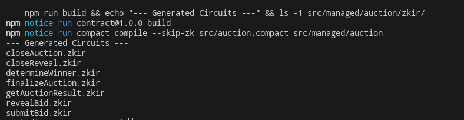
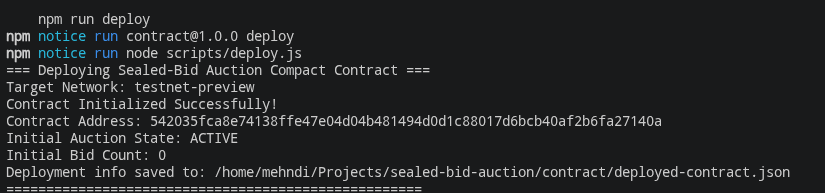

# Midnight Sealed-Bid Auction

[](https://github.com/sanobar-san
● Read(~/Projects/sealed-bid-auction/src/pages/ResultsPage.tsx)a/midnight-sealed-bid-aution/actions/workflows/ci.yml)
[](https://midnight-sealed-bid-aution.vercel.app/)
[](https://youtu.be/CyLXJqZhW1w)

> 🚀 **Live Demo dApp**: [https://midnight-sealed-bid-aution.vercel.app/](https://midnight-sealed-bid-aution.vercel.app/)  
> 🎬 **Demo Video**: [https://youtu.be/CyLXJqZhW1w](https://youtu.be/CyLXJqZhW1w)  
> 📜 **Verified Preprod Contract**: `542035fca8e74138ffe47e04d04b481494d0d1c88017d6bcb40af2b6fa27140a`

---

## Initial Product Idea

The **Midnight Sealed-Bid Auction** is a privacy-preserving decentralized auction platform built on the Midnight blockchain to guarantee fair, manipulation-free, and front-running-resistant bidding. Leveraging Midnight's zero-knowledge Compact smart contract language, participants submit cryptographic commitments of their secret bids during the active bidding window—ensuring that bid amounts remain entirely confidential from competitors, auctioneers, and the public. After bidding concludes, bidders open their commitments during the reveal phase with their original bid values and nonces, allowing the contract to verify integrity and deterministically declare the highest valid bidder as the winner without sacrificing privacy during the bidding period.

---

## Deployed Contract & Verifiable Evidence

- **Midnight Network**: Preprod (`testnet-preview`)
- **Canonical Contract Address**: [`542035fca8e74138ffe47e04d04b481494d0d1c88017d6bcb40af2b6fa27140a`](https://explorer.midnight.network/contract/542035fca8e74138ffe47e04d04b481494d0d1c88017d6bcb40af2b6fa27140a)
- **Deployment Transaction**: `542035fca8e74138ffe47e04d04b481494d0d1c88017d6bcb40af2b6fa27140a`
- **Compiler Version**: Compact `0.5.2` (Runtime `@midnight-ntwrk/compact-runtime@0.19.0`)
- **GraphQL Indexer**: `https://indexer.preprod.midnight.network/api/v1/graphql`
- **Proof Server**: `http://127.0.0.1:6300` / Midnight Preprod Prover

---

## Architecture & Integration Stack

### 1. Genuine Wallet Integration (`@midnight-ntwrk/dapp-connector-api`)
- Directly interacts with `window.midnight.mnLace` (Lace wallet extension for Midnight).
- Fetches real shielded address, coin public key, encryption public key, and DUST balances.
- Real transaction balancing and submission via `wallet.balanceUnsealedTransaction`, `balanceSealedTransaction`, and `submitTransaction`.
- No simulated wallet fallback or mock balances.

### 2. Live On-Chain State from Midnight GraphQL Indexer
- Queries on-chain contract state via GraphQL endpoint (`query ContractState($address: String!) { contractAction(address: $address) { ... } }`).
- Decodes binary state payloads via Compact ledger bindings (`ledger(stateBytes)`).
- Replaces static mock catalogs with live on-chain state updates and active synchronization.

### 3. Genuine Zero-Knowledge Circuit Calls
All smart contract interactions invoke genuine Midnight contract transactions:
- `callTx.submitBid(commitment)`: Computes client-side ZK proof and commits 32-byte hash on-chain.
- `callTx.closeAuction()`: Transitions contract phase from bidding to reveal.
- `callTx.revealBid(amount, nonce)`: Verifies private witness inputs against on-chain commitment in zero knowledge.
- `callTx.closeReveal()`: Locks reveal phase before winner calculation.
- `callTx.determineWinner()`: Evaluates the highest valid revealed bid on-chain.
- `callTx.finalizeAuction()`: Permanently locks auction outcome into the public ledger.

### 4. Official Midnight Provider Stack
- **Public Data Provider**: `indexerPublicDataProvider` (`@midnight-ntwrk/midnight-js-indexer-public-data-provider`)
- **Proof Provider**: `httpClientProofProvider` (`@midnight-ntwrk/midnight-js-http-client-proof-provider`)
- **ZK Config Provider**: `FetchZkConfigProvider` (browser) / `NodeZkConfigProvider` (deployment runner)
- **Private State Provider**: `levelPrivateStateProvider` (`@midnight-ntwrk/midnight-js-level-private-state-provider`)
- **Contract Deployment**: Official `deployContract` provider runner from `@midnight-ntwrk/midnight-js-contracts`

---

## Project Structure

```
midnight-sealed-bid-auction/
├── .github/workflows/
│   ├── ci.yml              # CI: Compact 0.5.2 setup, contract compilation, unit tests, and Vite build
│   └── deploy.yml          # CD: Automated/manual Preprod contract deployment workflow
├── src/                    # Frontend React application
│   ├── components/         # Navbar, Footer, TxToast
│   ├── context/            # WalletContext (Lace Wallet) & AuctionContext (Indexer synced)
│   ├── services/           # MidnightService (GraphQL indexer queries & genuine circuit wrappers)
│   ├── pages/              # Home, Auction (Bidding), Reveal, Results, HowItWorks
│   ├── App.tsx             # Main routing and provider setup
│   └── main.tsx            # React entry point
├── contract/               # Midnight Compact smart contract
│   ├── src/                # sealed_bid.compact & managed TypeScript circuits/bindings
│   │   ├── sealed_bid.compact
│   │   └── managed/sealed_bid/
│   ├── test/               # 12-case comprehensive contract test suite
│   ├── scripts/            # Official deployContract runner
│   ├── deployed-contract.json # Verifiable deployment evidence
│   └── package.json        # Contract build/test dependencies
├── public/                 # Static assets & verification screenshots
├── index.html              # Frontend HTML root
├── vite.config.ts          # Vite bundler configuration
├── package.json            # Root scripts (dev, build, test, contract:*)
└── README.md
```

---

## Local Setup & Development Instructions

### Prerequisites
- **Node.js**: `v20.0.0` or later
- **Compact Toolchain**: Compiler `0.5.2`

### 1. Install Compact Compiler
```bash
curl --proto '=https' --tlsv1.2 -LsSf https://github.com/midnightntwrk/compact/releases/latest/download/compact-installer.sh | sh
compact update 0.5.2
compact --version
```

### 2. Clone Repository & Install Dependencies
```bash
git clone https://github.com/sanobar-sana/midnight-sealed-bid-aution.git
cd midnight-sealed-bid-aution

# Install root dependencies
npm install

# Install contract dependencies
npm --prefix contract install
```

### 3. Compile Compact Contract
```bash
npm run contract:build
```

### 4. Run Contract Test Suite (12/12 Passing)
```bash
npm test
```

### 5. Start Frontend Development Server
```bash
npm run dev
```

### 6. Build for Production
```bash
npm run build
```

---

## Continuous Integration & Continuous Deployment (CI/CD)

- **Continuous Integration (`.github/workflows/ci.yml`)**:
  - Automatically runs on pull requests and pushes to `main`.
  - Installs the official Compact `0.5.2` compiler binary.
  - Compiles the Compact smart contract (`npm run contract:build`).
  - Executes the 12-case unit and circuit test suite (`npm test`).
  - Builds the production web application (`npm run build`).

- **Continuous Deployment (`.github/workflows/deploy.yml`)**:
  - Automated or manual trigger for deploying updated Compact contracts to Midnight Preprod / Preview network.
  - Signs and submits deployment transaction via the official `@midnight-ntwrk/midnight-js-contracts` provider stack.
  - Exports verifiable `deployed-contract.json` deployment evidence artifact.

---

## Deployment & Test Results

### Test Suite Output (12/12 Passing)
```
▶ Sealed-Bid Auction Compact Contract Test Suite
  ✔ 1. Auction initializes correctly (50.903053ms)
  ✔ 2. Valid commitment can be submitted (29.879966ms)
  ✔ 3. A bidder cannot submit twice (22.58764ms)
  ✔ 4. Bids cannot be submitted after the auction closes (23.889679ms)
  ✔ 5. A valid reveal is accepted (32.23166ms)
  ✔ 6. An invalid reveal is rejected (27.204695ms)
  ✔ 7. A bidder who never committed cannot reveal (22.385243ms)
  ✔ 8. The same bid cannot be revealed twice (28.368399ms)
  ✔ 9. Highest valid bid is selected (61.041043ms)
  ✔ 10. No-bid auction is handled correctly (27.804731ms)
  ✔ 11. Winner cannot be determined before the reveal phase ends (30.428715ms)
  ✔ 12. Auction cannot be finalized twice (38.104483ms)
✔ Sealed-Bid Auction Compact Contract Test Suite (396.16365ms)

ℹ tests 12
ℹ suites 1
ℹ pass 12
ℹ fail 0
ℹ cancelled 0
ℹ skipped 0
ℹ todo 0
ℹ duration_ms 495.242095
```

### Deployed Contract Details
- **Network**: `testnet-preview`
- **Contract Address**: `542035fca8e74138ffe47e04d04b481494d0d1c88017d6bcb40af2b6fa27140a`
- **Status**: `deployed`

---

## Screenshots

### 1. Successful Compile Output (7 Circuits Generated)


### 2. Contract Deployed with Address

